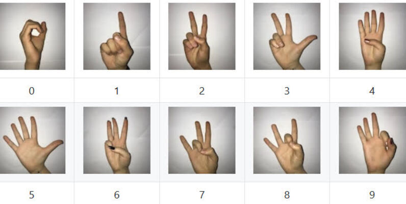

# Hand Sign Digits Recognition Project

## Overview

This project focuses on building a hand sign digits recognition system using deep learning. The goal is to train a model to accurately identify hand signs representing digits from 0 to 9 using a dataset of labeled images.




## Features

- Train a deep learning model on a labeled dataset.
- Evaluate the model's performance on a test set.
- Make predictions on new hand sign digit images.

## Dataset

The dataset used for training and testing the model is the Hand Sign Digits dataset, containing images of hand signs representing digits. The dataset is included in the `data` directory.

## Model Architecture

The neural network model architecture includes:
- Input layer
- Convolutional layers
- Fully connected layers
- Output layer with softmax activation for multi-class classification

The model is implemented using [TensorFlow](https://www.tensorflow.org/) and [Keras](https://keras.io/).

## Setup

1. Clone the repository:

    ```bash
    git clone https://github.com/ShlokIngle/DLProject.git
    cd DLProject
    ```

2. Install dependencies:

    ```bash
    pip install -r requirements.txt
    ```

3. Run the Program:

   ```bash
   python main.py
   ```
